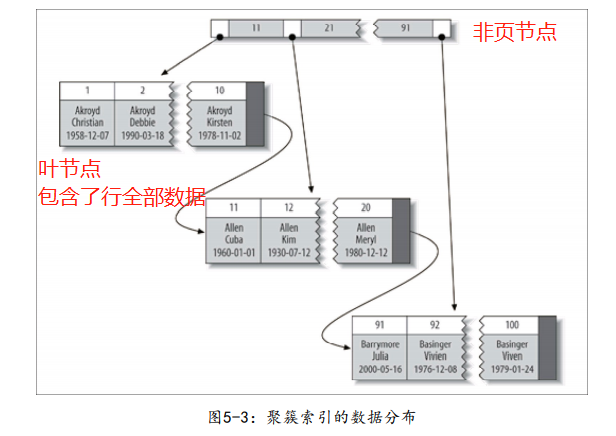
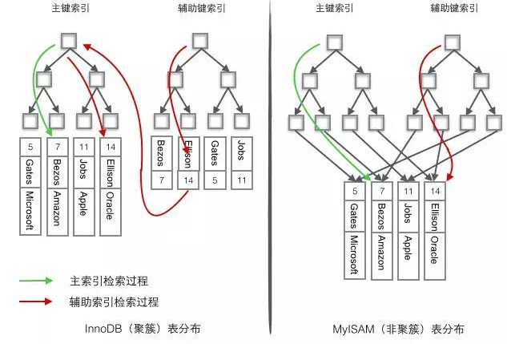
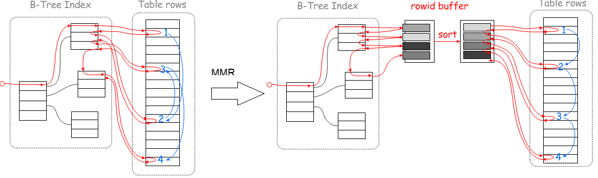
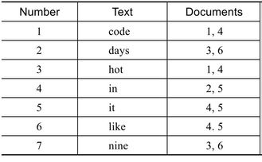
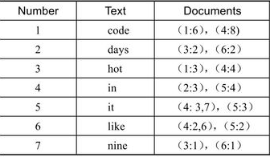
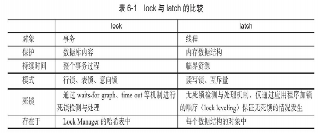
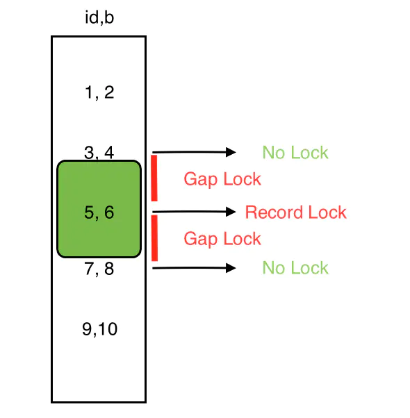
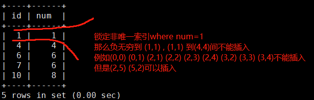

# Innodb存储引擎


# 引擎内存架构

## 后台线程


Master Thread具有最高的线程优先级别。其内部由多个循环组 成：主循环（loop）、后台循环（backgroup loop）、刷新循环（flush loop）、暂停循环（suspend loop）。Master Thread会根据数据库运行的状态在各个loop之间进行切换。


Loop基础伪代码：

```c
void master_thread(){
loop：
	for(int i=0;i＜10;i++){
		do thing once per second
		sleep 1 second if necessary
	}
	do things once per ten seconds
goto loop;
}
```

1.0.x前Loop每秒一次的操作包括：

-  日志缓冲刷新到磁盘，即使这个事务还没有提交（总是）；
-  合并插入缓冲（如果一秒内发生的IO次数小于5次）；
-  至多刷新100个InnoDB的缓冲池中的脏页到磁盘（如果当前缓冲池中脏页的比例超过了配置文件中`innodb_max_dirty_pages_pct`这个参数）；
-  如果当前没有用户活动，则切换到background loop（可能）

Loop每10秒的操作包括： 

- 刷新100个脏页到磁盘（如果过去10秒之内磁盘的IO操作小于200次）；
- 合并至多5个插入缓冲（总是）；
- 将日志缓冲刷新到磁盘（总是）；
- 删除无用的Undo页（总是）；
- 刷新100个或者10个脏页到磁盘（总是）。

1.0.x后：

在合并插入缓冲时，合并插入缓冲的数量为innodb_io_capacity值的 5%；

在从缓冲区刷新脏页时，刷新脏页的数量为innodb_io_capacity。

判断产生重做日志（的速度来决定最合适的刷新脏页数量。因此当脏页的比例小于innodb_max_dirty_pages_pct时，也会刷新一定量的脏页

1.2.x后：

对于刷新脏页的操作，从Master Thread线程分离到一个单独的Page Cleaner Thread


## 内存


### LRU List


LRU list分为两个子list`New`和`Old`，`midpoint`是两个子list的分界点，`old list`占整个buffer pool的多少由参数`innodb_old_blocks_pct`决定

LRU算法规则：

- 当需要插入新页面而LRU满了，则淘汰尾部的页面

- 当新页面进入LRU，先插入到`midpoint` 即 `old list`的head，当第一次访问这个页面时：

  - 参数`innodb_old_blocks_time`为0，立即将页面移动到`new list`的头部
  - 参数...不为0，则在第一次访问后`innodb_old_blocks_time`时间内，对页面的访问都不会使其被移至`new list`的头部


改进原因：

> 若直接将读取到的页放入到LRU的首部，那么某些SQL操作可能会使缓冲池中的页被刷新出，从而影响缓冲池的效率。常见的这类操作为索引或数据的扫描操作。这类操作需要访问表中的许多页，甚至是全部的页，而这些页通常来说又仅在这次查询操作中需要，并不是活跃的热点数据。如果页被放入LRU列表的首部，那么非常可能将所需要的热点数据页从LRU列表中移除，而在下一次需要读取该页时，InnoDB存储引擎需要再次访问磁盘。

可能由于继续读入表的更多页和pct设置的较小，先前插入在midpoint的页面在在`innodb_old_blocks_time`时间内就被淘汰了，而不会移到热端，以此来保护热点数据；可知，time设置的越长，新插入的页面会更快老化

当扫描不能完全容纳在缓冲池中的大表时，将`innodb_old_blocks_pct`设置为较小的值可以使仅读取一次的数据不会占用缓冲池的很大一部分。 例如，设置`innodb_old_blocks_pct` = 5会将仅读取一次的数据限制为缓冲池的5％。

扫描适合内存的小表时，在缓冲池中移动页面的开销较小，因此可以将`innodb_old_blocks_pct`保留为默认值，甚至更高。


## Checkpoint


### Fuzzy Checkpoint

1. **Master Thread Checkpoint**

   对于Master Thread中发生的Checkpoint，差不多以每秒或每十秒的速度从缓冲池的脏页列表中刷新一定比例的页回磁盘。这个过程是异步的即此时引擎可以进行其他的操作，用户查询线程不会阻塞

2. **FLUSH_LRU_LIST Checkpoint** 

   InnoDB存储引擎需要保证LRU列 表中需要有差不多100个空闲页可供使用。倘若没有100个可用空闲页，那么InnoDB存储引擎会将LRU列表尾端的页移除。如果这些页中有脏页，那么需要进行 Checkpoint。

3. **Async/Sync Flush Checkpoint**

   重做日志文件不可用的情况，这时需要强制将一些页刷新回磁盘，而此时脏页是从脏页列表中选取的

   

4. **Dirty Page too much Checkpoint**

   Dirty Page too much，即脏页的数量太多，导致InnoDB存储引擎强制进行Checkpoint。其目的总的来说还是为了保 证缓冲池中有足够可用的页。其可由参数`innodb_max_dirty_pages_pct`控制


##  InnoDB关键特性

### 1、change buffer

对于读操作有缓冲池减少磁盘IO，那么对于写操作innodb也做了对应的操作减少磁盘IO


可以对DML操作——`INSERT`、 `DELETE` 、 `UPDATE` 都 进 行 缓 冲 ， 他 们 分 别 是 ： `Insert Buffer` 、` Delete Buffer`、`Purge buffer`。

**解决问题：**对于非聚集索引叶子节点的插入不再是顺序的了，这时就需要离散地访问非聚集索引页， 由于随机读取的存在而导致了插入操作性能下降。

**解决方案：**<u>对于非聚集索引的插入或更新操作，不是每一次直接插入到索引页中，而是先判断插入的非聚集 索引页是否在缓冲池中</u>，若在，则直接插入；若不在，则先放入到一个 `change Buffer`数据结构(实为b+树)中。然后再以一定的频率和情况 进行`chnage Buffer`和辅助索引页子节点的merge（合并）操作，这时通常能将多个插入合并到一个操作中（因为在一个索引页中），这就大大提高了对于非聚集索引插入的性能

change Buffer的使用需要同时满足以下两个条件： 

- 索引是辅助索引（secondary index）； 
- 索引不是唯一（unique）的

对change buffer的merge什么时候会发生：

- 辅助索引页被读取到缓冲池时；
- master thread执行对change buffer的合并


### 2、doublewrite

**解决问题**：doublewrite（两次写）带给InnoDB存储引擎的是数据页的可靠性。当发生数据库宕机时，可能InnoDB存储引擎正在写入某个页到表中， 而这个页只写了一部分，比如16KB的页，只写了前4KB，之后就发生了宕 机，这种情况被称为**部分写失效**（partial page write）。**重做日志中记录的是对页的物理操作，如果这个页本身已经发生了损坏， 再对其进行重做是没有意义的**。

在应用（apply）重做日志前， 用户需要一个页的副本，当写入失效发生时，先通过页的副本来还原该 页，再进行重做，这就是doublewrite。

**解决方案**：


doublewrite由两部分组成，一部分为内存中的doublewrite buffer，其大小为2MB，另一部分是磁盘上共享表空间(ibdata x)中连续的128个页，即2个区(extent)，大小也是2M。

1. 当一系列机制触发数据缓冲池中的脏页刷新时，并不直接写入磁盘数据文件中，而是先`memcpy`拷贝至内存中的doublewrite buffer中；
2. 接着从两次写缓冲区分两次写入磁盘共享表空间中(连续存储，顺序写，性能很高)，每次写1MB；
3. 待第二步完成后，再将doublewrite buffer中的脏页数据写入实际的各个表空间文件(离散写)；(脏页数据固化后进行标记对应doublewrite数据可覆盖)


情况分析：

1. 离散写的时候发生部分写失效，则通过doublewrite磁盘空间恢复页，再进行重做
2. doublewrite顺序写磁盘时失效，这时只是doublewrite部分写失效，实际页没有损害，直接进行重做
3. 文件系统不会出现部分写失效，则可以关闭doublewrite


### 3、自适应哈希索引

InnoDB存储引擎会**监控对表上各索引页的查询。如果观察到建立哈希索引可以带来速度提升，则建立哈希索引**，称之为自适应哈希索引 （Adaptive Hash Index，AHI）。AHI是通过缓冲池的B+树页构造而来，因此建立的速度很快，而且不需要对整张表构建哈希索引

AHI要求，即对这个页的连续访问模式（查询条件）必须是一样的，并且以该模式访问了页达到一定次数

由于是hash索引，所以只支持搜索等值的查询（where xxx=yyy），不能范围查找、排序等


# 索引

## B+ Tree 原理

### 1. 数据结构

B Tree 指的是 Balance Tree，也就是平衡树。平衡树是一颗查找树，并且所有叶子节点位于同一层。

B+ Tree 是基于 B Tree 和叶子节点顺序访问指针进行实现，它具有 B Tree 的平衡性，并且通过顺序访问指针来提高区间查询的性能。

在 B+ Tree 中，一个节点中的 key 从左到右非递减排列，如果某个指针的左右相邻 key 分别是 key<sub>i</sub> 和 key<sub>i+1</sub>，且不为 null，则该指针指向节点的所有 key 大于等于 key<sub>i</sub> 且小于等于 key<sub>i+1</sub>。


<div align="center">  </div><br>

### 2. 操作

进行查找操作时，首先在根节点进行二分查找，找到一个 key 所在的指针，然后递归地在指针所指向的节点进行查找。直到查找到叶子节点，然后在叶子节点上进行二分查找，找出 key 所对应的 data。

插入删除操作会破坏平衡树的平衡性，因此在进行插入删除操作之后，需要对树进行分裂、合并、旋转等操作来维护平衡性。

### 3. 与红黑树的比较

红黑树等平衡树也可以用来实现索引，但是文件系统及数据库系统普遍采用 B+ Tree 作为索引结构，这是因为使用 B+ 树访问磁盘数据有更高的性能。

（一）B+ 树有更低的树高

平衡树的树高 O(h)=O(log<sub>d</sub>N)，其中 d 为每个节点的出度。红黑树的出度为 2，而 B+ Tree 的出度一般都非常大，所以红黑树的树高 h 很明显比 B+ Tree 大非常多。

（二）磁盘访问原理

操作系统一般将内存和磁盘分割成固定大小的块，每一块称为一页，内存与磁盘以页为单位交换数据。数据库系统将索引的一个节点的大小设置为页的大小，使得一次 I/O 就能完全载入一个节点。

如果数据不在同一个磁盘块上，那么通常需要移动制动手臂进行寻道，而制动手臂因为其物理结构导致了移动效率低下，从而增加磁盘数据读取时间。B+ 树相对于红黑树有更低的树高，进行寻道的次数与树高成正比，在同一个磁盘块上进行访问只需要很短的磁盘旋转时间，所以 B+ 树更适合磁盘数据的读取。

（三）磁盘预读特性

为了减少磁盘 I/O 操作，磁盘往往不是严格按需读取，而是每次都会预读。预读过程中，磁盘进行顺序读取，顺序读取不需要进行磁盘寻道，并且只需要很短的磁盘旋转时间，速度会非常快。并且可以利用预读特性，相邻的节点也能够被预先载入。


## B+ Tree 索引

### 聚簇索引



- 将数据存储与索引放到了一块，找到索引也就找到了数据，也因此聚簇索引是表唯一的
- 逻辑上，聚簇索引数据的存储是连续的，并按照索引键值排序；
- 物理上，InnoDB 只聚集在同一个页中的记录，逻辑上相邻键值的记录可能分布在两个不同的页面，而这些页面可能不是物理连续的


#### 聚簇索引的优势

1. 通过聚集索引访问行是快速的，因为索引搜索直接导向包含行数据的页面
2. 逻辑顺序紧邻的数据，物理上也紧邻（在同一个页中的情况）
3. 这一点其实是1的延伸，对于I/O密集型的**范围查询会比非聚簇索引的I/O要少得多**：根据b+树的特性叶节点间有指针链接，所以只需要查询到范围的下界对应的叶节点，然后沿着叶节点形成的链表往下读取直到范围的上界，而不需要对应范围内每个值都进行索引；但是聚簇索引在读叶节点过程中行数据也读出来了，非聚簇索引还要根据地址把每行IO出来

#### 聚簇索引的劣势

1. 聚簇索引可能导致全表扫描变慢，尤其是行比较稀疏，或者由于页分裂导致数据存储不连续的时候。
2. 更新聚簇索引列的代价很高，因为会强制InnoDB将每个被更新的行移动到新的位置（可能从一个页移动到另一个页）
3. 聚簇数据最大限度地提高了I/O密集型应用的性能，但如果数据全部都放在内存中，则访问的顺序就没那么重要了，聚簇索引也就没什么优势了
4. 二级索引访问需要两次索引查找
5. 如果不按主键顺序插入数据，InnoDB不得不频繁地做页分裂操作。页分裂会导致移动大量数据，一次插入最少需要修改三个页而不是一个页。


#### Innodb的主索引和二级索引

1. InnoDB在主键(或别的唯一非空键)上建立聚簇索引，将**主键组织到一棵B+树**中，而**行数据就储存在叶子节点**上，若使用"where id = 14"这样的条件查找主键，则**按照B+树的检索算法即可查找到对应的叶节点，之后获得行数据**。
2. 而二级索引，innodb对辅助键建立了辅助索引，辅助索引的叶节点存储的是主键值。若对Name列进行条件搜索，则需要两个步骤：**第一步在辅助索引B+树中检索Name，到达其叶子节点获取对应的主键**。第二步**使用主键在主索引B+树种再执行一次B+树检索操作，最终到达叶子节点即可获取整行数据**。




### 非聚簇索引

将数据存储于索引分开结构，索引结构的叶子节点指向了数据的对应行。


MyISAM使用的是非聚簇索引，主键索引B+树的节点存储了主键，辅助键索引B+树存储了辅助键。**表数据存储在独立的地方，这两颗B+树的叶子节点都使用一个地址指向真正的表数据**，对于表数据来说，这两个键没有任何差别。所以MyISAMy的表可以没有主键。

物理上，MyISAM的数据分布非常简单，按照数据插入的顺序存储在磁盘上


### 联合索引

联合索引是指对表上的多个列进行索引（即多个列作为key）。从本质上来说，联合索引也是一棵B+树，不同的是联合索引的键值的数量不是1，而是大于等于2。

> 对于查询SELECT*FROM TABLE WHERE a=xxx and b=xxx，显 然 是 可 以 使 用 （ a ， b ） 这 个 联 合 索 引 的 。 对 于 单 个 的 a 列 查 询SELECT*FROM TABLE WHERE a=xxx，也可以使用这个（a，b）索引。

联合索引的好处是已经对第二个键值进行了排序处理


### 覆盖索引

如果一个索引包含（或者说覆盖）所有需要查询的字段的值，我们就称之为“覆盖索引”。这样从辅助索引中就可以得到查询的记录，而不需要回表。

**回表**：对聚簇索引，当通过辅助索引查询到行后，还需要通过主索引拿到行数据，这个过程称为回表

**优势**：

1. 索引条目通常远小于数据行大小，所以如果只需要读取索引，那MySQL就会极大地减少数据访问量。
2. 因为索引是按照列值顺序存储的（至少在单个页内是如此），所以 对于I/O密集型的范围查询会比随机从磁盘读取每一行数据的I/O要少得多（根据b+树的特性叶节点间有指针链接，所以只需要查询到范围的下界对应的叶节点，然后沿着叶节点形成的链表往下读取直到范围的上界，而不需要对应范围内每个值都进行索引）
3. InnoDB 的二级索引在叶子节点中保存了行的主键值，所以如果二级主键能够覆盖查询，则可以避免对主键索引的二次查询。


### Multi-Range Read优化

**目的**：的就是为了减少磁盘的随机访问，并且将随机访问转化为较为顺序的数据访问

**工作方式**：

1. 将查询得到的辅助索引键值存放于一个缓存中，这时缓存中的数据是 根据辅助索引键值排序的。 
2. 将缓存中的键值根据RowID进行排序。 
3. 根据RowID的排序顺序来访问实际的数据文件。

**好处：**MRR使数据访问变得较为顺序。

在查询辅助索引时，首先根据得到的查询结果，按照主键进行排序，并按照主键排序的顺序进行书签查找。




### Index Condition Pushdown（ICP）优化

5.6前的MySQL数据库版本 不支持ICP，当进行索引查询时，首先根据索引来查找记录，然后再根据WHERE条件来过滤记录。在支持ICP后，**MySQL数据库会在取出索引的同时，判断是否可以进行WHERE条件的过滤**，也就是将WHERE的部分过滤操作放在了存储引擎 层


**示例**：假设某张表有联合索引(zip_code，last_name，firset_name)，并且查询 语句如下：

```sql
 SELECT*FROM people WHERE zipcode='95054' AND lastname LIKE'%etrunia%' AND address LIKE'%Main Street%';
```

对于上述语句，MySQL数据库可以通过索引来定位zipcode等于95 054 的记录，但是索引对WHERE条件的lastname LIKE'%etrunia%'AND address LIKE'%Main Street%'没有任何帮助。

- 若不支持ICP优 化，则数据库需要先通过索引取出所有zipcode等于95 054的记录，然后再过滤WHERE之后的两个条件。
- 若支持ICP优化，则在索引取出时，就会进行 WHERE条件的过滤，然后再去获取记录。


## 全文检索

**定义：**全文检索（Full-Text Search）是将存储于数据库中的整本书或整篇文章 中的任意内容信息查找出来的技术


### 倒排索引

全文检索通常使用倒排索引（inverted index）来实现。它在**辅助表（auxiliary table）**中存储 了单词与单词自身在一个或多个文档中所在位置之间的映射，这通常利用 关联数组实现，其拥有两种表现形式：

- `inverted file index`，其表现形式为{单词，单词所在文档的ID}

  

- `full invertedindex`，其表现形式为{单词，(单词所在文档的ID，在文档中的具体位置)}

  


InnoDB采用`full inverted index`的方式。将`(DocumentId，Position)`视 为一个`“ilist”`。因此在全文检索的表中，有两个列，一个是`word字段`，另一个是`ilist字段`，并且在`word字段`上有设有索引


# 锁

## lock和latch

latch一般称为闩锁（轻量级的锁），因为其要求锁定的时间必须非常短。若持续的时间长，则应用的性能会非常差。在InnoDB存储引擎中， **latch又可以分为mutex（互斥量）和rwlock（读写锁）**。其目的是用来**保证并发线程操作临界资源的正确性**，并且通常**没有死锁检测**的机制。

lock的对象是事务，用来锁定的是数据库中的对象，如表、页、行。并 且一般lock的对象仅在事务commit或rollback后进行释放。lock是有死锁机制的。




## 锁的类型

### 1. 读写锁

- 互斥锁（Exclusive），简写为 X 锁，又称写锁。
- 共享锁（Shared），简写为 S 锁，又称读锁。

有以下两个规定：

- 一个事务对数据对象（表或表的某一行） A 加了 X 锁，就可以对 A 进行读取和更新。加锁期间其它事务不能对 A 加任何锁。
- 一个事务对数据对象（表或表的某一行） A 加了 S 锁，可以对 A 进行读取操作，但是不能进行更新操作。加锁期间其它事务能对 A 加 S 锁，但是不能加 X 锁。

锁的兼容关系如下：

<div align="center">  </div><br>

### 2. 意向锁

意向锁（Intention Locks）是Indoob多粒度锁的一种**表锁**，它**不与行级的互斥/排他锁冲突**

**为什么需要意向锁**：在存在行级锁和表级锁的情况下，事务 T 想要对表 A 加 X 锁，就需要先检测是否有其它事务对表 A 或者表 A 中的任意一行加了锁，那么就需要对表 A 的每一行都检测一次，这是非常耗时的。


意向锁分为两种：

- **意向共享锁**（intention shared lock, IS）：事务有意向对<u>表中的某些行</u>加**共享锁**（S锁）

```text
-- 事务要获取某些行的 S 锁，必须先获得表的 IS 锁或者更低粒度的锁。
SELECT column FROM table ... LOCK IN SHARE MODE; 
```

- **意向排他锁**（intention exclusive lock, IX）：事务有意向对<u>表中的某些行</u>加**排他锁**（X锁）

```text
-- 事务要获取某些行的 X 锁，必须先获得表的 IX 锁。
SELECT column FROM table ... FOR UPDATE; 
```

*意向锁是有数据引擎自己维护的，用户无法手动操作意向锁，在为数据行加共享 / 排他锁之前，InooDB 会先获取该数据行所在在数据表的对应意向锁。*


通过引入意向锁，事务 T 想要**对表 A 加表级的 X 锁**，只需要先**检测是否有其它事务对表 A 加了表级的X/IX/S/IS 锁**，而不必检查各个页或行锁，如果加了就表示有其它事务正在使用这个表或者表中某一行的锁，因此事务 T 加 X 锁失败。

<div align="center">  </div><br>

解释如下：

- 任意 IS/IX 锁之间都是兼容的，因为它们只表示想要对表加锁，而不是真正加锁；
- **这里兼容关系针对的是表级锁**，而表级的 IX 锁和行级的 X 锁兼容，两个事务可以对两个数据行加 X 锁。（事务 T<sub>1</sub> 想要对数据行 R<sub>1</sub> 加 X 锁，事务 T<sub>2</sub> 想要对同一个表的数据行 R<sub>2</sub> 加 X 锁，两个事务都需要对该表加 IX 锁，但是 IX 锁是兼容的，并且 IX 锁与行级的 X 锁也是兼容的，因此两个事务都能加锁成功，对同一个表中的两个数据行做修改。）


### 3. Auto-INC Lock

在InnoDB存储引擎的内存结构中，对每个含有自增长值的表都有一个自增长计数器（auto-increment counter）。当对含有自增长的计数器的表进行插入操作时，这个计数器会被初始化。

AUTO-INC Lock，这种锁其实是采用一种特殊的**表锁**机制，为了**提高并发插入的效率**，锁不是在一个事务完成后才释放，而是在**完成对自增长值插入的SQL语句后立即释放**，这样同一时间只有一个插入语句能持有锁。

| 插入类型           | 说明                                                         |
| ------------------ | ------------------------------------------------------------ |
| insert-like        | 所有可以向表中增加行的语句                                   |
| simple inserts     | **可以预先确定要插入的行数（当语句被初始处理时）的语句**。 这包括没有嵌套子查询的单行和多行INSERT和REPLACE语句，但不包括INSERT ... ON DUPLICATE KEY UPDATE。 |
| bulk inserts       | **事先不知道要插入的行数的语句**                             |
| mixed-mode inserts | 插入中一部分值是自增长的，一部分值是确定的（语句指定了pk值）；示例如下，其中c1是表t1的AUTO_INCREMENT列： <br/>`INSERT INTO t1 (c1,c2) VALUES (1,'a'), (NULL,'b'), (5,'c'), (NULL,'d');` |

| innodb_autonic_lock_mode | 说明                                                         |
| ------------------------ | ------------------------------------------------------------ |
| 0                        | 在此锁定模式下，所有“INSERT-like”语句获得一个特殊的表级AUTO-INC锁，用于插入具有AUTO_INCREMENT列的表。 |
| 1                        | 默认的锁定模式。“Simple inserts”（要插入的行数事先已知）通过在mutex（轻量锁）的控制下获得所需数量的自动递增值。“bulk inserts”仍然使用AUTO-INC表级锁。 |
| 2                        | 所有类INSERT(“INSERT-like” )自增值的产生都通过互斥量。自动递增值保证在所有并发执行的“类INSERT”语句中是唯一且单调递增的。但是由于多个语句可以同时生成数字，为任何给定语句插入的行生成的值可能不是连续的。 |

MyISAM存储引擎是表锁设计，自增长不用考虑并发插入的问题。

在InnoDB存储引擎中，自增长值的列必须是索引，同时必须是索引的第一个列


### 4. Record Lock

对单个行记录上的锁。注意Record Lock总是会去锁住索引记录，而非记录本身。

For example, `SELECT c1 FROM t WHERE c1 = 10 FOR UPDATE;` prevents any other transaction from inserting, updating, or deleting rows where the value of `t.c1` is `10`.


### 5. Gap Lock

锁定索引记录之间的gap，但是gap lock是不会锁定索引记录本身的，它的**唯一目的是防止其他事务插入间隙**。

间隙锁可以共存。一个事务进行的间隙锁定不会阻止另一事务对相同的间隙进行间隙锁定。共享间隙锁和排他间隙锁之间没有区别。它们彼此不冲突，并且执行相同的功能。




<center>gap lock防止在3、5或者5、7之间插入，但是并不会锁住357</center>

间隙锁定可以显式禁用，如果将事务隔离级别更改为READ COMMITTED或启用innodb_locks_unsafe_for_binlog系统变量。所以**在RU和RC两种隔离级别下**，即使你使用**select ... in share mode或select ... for update，也无法防止幻读**（读后写的场景）。因为这两种隔离级别下只会有**行锁**，而不会有**间隙锁**。


### 6. Next-Key Lock

Gap Lock + Record Lock，锁定一个范围，并且锁定记录本身。其设计的目的是为了解决Phantom Problem

Gap Lock + Record Lock：临键锁是**索引记录上的Record lock**和**索引记录之前的gap上的gap lock**的**组合**。

- Next-Key Lock降级为Record Lock仅在查询的列是唯一索引且是精确等值检索的情况下。

- 范围检索，无论是否唯一索引，都会锁住where条件中相应的范围，范围中的记录以及间隙

- 非唯一索引 + 精确等值检索

  

- 非索引列，锁全表

```sql
从上面gap lock的图举例，执行 SELECT * FROM t where id > 5 FOR UPDATE;
其锁住的不单是7、9行，还对(5,+∞)这个范围加了X锁，对这个范围的任何插入都会阻塞, 因此不会出现两次select结果不一致的情况

SELECT * FROM t where id > 5 AND id < 9 FOR UPDATE;
锁住(5, 9]
```

InnoDB的默认事务隔离级别是RR，在这种级别下，如果你使用select ... in share mode或者select ... for update语句，那么InnoDB会使用临键锁，因而可以防止幻读；但即使你的隔离级别是RR，如果你这是使用普通的select语句，那么InnoDB将是快照读，不会使用任何锁，因而还是无法防止幻读。


### 一致性非锁定读

InnoDB存储引擎通过**行多版本控制**（multi versioning）的方式来读取当前执行时间数据库中行的数据。**如果读取的行正在执行DELETE或UPDATE操作，这时读取操作不会因此去等待行上X锁的释放**。相反地，InnoDB存储引擎**会去读取行的一个快照数据**。

在`READ COMMITTED`事务隔离级别下，对于快照数据，非一致性读总是读取被锁定行的最新一份快照数据。而在`REPEATABLE READ`事务隔离级别下，对于快照数据，非一致性读总是读取事务开始时的行数据版本。


### 一致性锁定读

在默认配置下，InnoDB存储引擎的SELECT操作使用一致性非锁定读。但是**在某些情况下，用户需要显式地对数据库读取操作进行加锁以保证数据逻辑的一致性**。

InnoDB存储引擎对于SELECT语句支持两种一致性的 **锁定读**（locking read）操作： 

- SELECT…FOR UPDATE （对读取的行记录加一个X锁）
- SELECT…LOCK IN SHARE MODE （对读取的行记录加一个S锁）


### 锁升级


## 并发问题

### 脏读

脏数据是指事务对缓冲池中行记录的修改，并且还没有被提交（commit）。如果读到了脏数据， 即一个事务可以读到另外一个事务中未提交的数据，则显然违反了数据库的隔离性。**脏读指的就是在不同的事务下，当前事务可以读到另外事务未提交的数据。**

### 不可重复读

不可重复 读读到的却是已经提交的数据，但是其违反了数据库事务一致性的要求。

在InnoDB存储引擎中，通过使用Next-Key Lock算法来避免不可重复读的问 题 。在 MySQL 官 方文档中将不可重复读的问题定义为Phantom Problem。

### 丢失更新

一个事务的更新操作会被另一个事务的更新操作所覆盖，从而导致数据的不一致。

逻辑意义的丢失更新问题：

1）事务T1查询一行数据，放入本地内存，并显示给一个终端用户 User1。 

2）事务T2也查询该行数据，并将取得的数据显示给终端用户User2。

3）User1修改这行记录，更新数据库并提交。 

4）User2修改这行记录，更新数据库并提交。


要避免丢失更新发生，需要让事务在这种情况下的操作变成串行化， 而不是并行的操作。即在上述四个步骤的1）中，对用户读取的记录加上一 个排他X锁。同样，在步骤2）的操作过程中，用户同样也需要加一个排他 X锁。通过这种方式，步骤2）就必须等待一步骤1）和步骤3）完成，最后 完成步骤4）。

