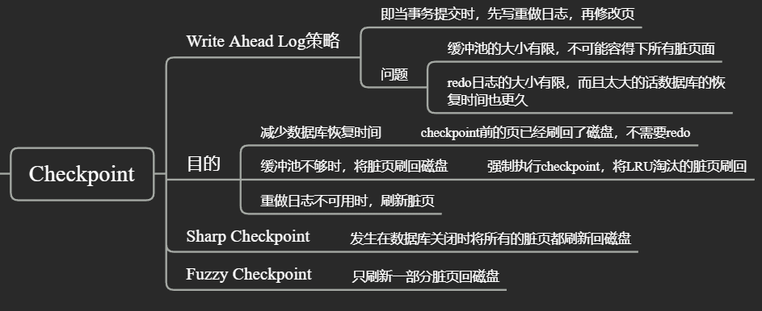

# Innodb存储引擎


# 引擎内存架构

## 后台线程


Master Thread具有最高的线程优先级别。其内部由多个循环组 成：主循环（loop）、后台循环（backgroup loop）、刷新循环（flush loop）、暂停循环（suspend loop）。Master Thread会根据数据库运行的状态在各个loop之间进行切换。


Loop基础伪代码：

```c
void master_thread(){
loop：
	for(int i=0;i＜10;i++){
		do thing once per second
		sleep 1 second if necessary
	}
	do things once per ten seconds
goto loop;
}
```

1.0.x前Loop每秒一次的操作包括：

-  日志缓冲刷新到磁盘，即使这个事务还没有提交（总是）；
-  合并插入缓冲（如果一秒内发生的IO次数小于5次）；
-  至多刷新100个InnoDB的缓冲池中的脏页到磁盘（如果当前缓冲池中脏页的比例超过了配置文件中`innodb_max_dirty_pages_pct`这个参数）；
-  如果当前没有用户活动，则切换到background loop（可能）

Loop每10秒的操作包括： 

- 刷新100个脏页到磁盘（如果过去10秒之内磁盘的IO操作小于200次）；
- 合并至多5个插入缓冲（总是）；
- 将日志缓冲刷新到磁盘（总是）；
- 删除无用的Undo页（总是）；
- 刷新100个或者10个脏页到磁盘（总是）。

1.0.x后：

在合并插入缓冲时，合并插入缓冲的数量为innodb_io_capacity值的 5%；

在从缓冲区刷新脏页时，刷新脏页的数量为innodb_io_capacity。

判断产生重做日志（的速度来决定最合适的刷新脏页数量。因此当脏页的比例小于innodb_max_dirty_pages_pct时，也会刷新一定量的脏页

1.2.x后：

对于刷新脏页的操作，从Master Thread线程分离到一个单独的Page Cleaner Thread


## 内存


### LRU List


LRU list分为两个子list`New`和`Old`，`midpoint`是两个子list的分界点，`old list`占整个buffer pool的多少由参数`innodb_old_blocks_pct`决定

LRU算法规则：

- 当需要插入新页面而LRU满了，则淘汰尾部的页面

- 当新页面进入LRU，先插入到`midpoint` 即 `old list`的head，当第一次访问这个页面时：

  - 参数`innodb_old_blocks_time`为0，立即将页面移动到`new list`的头部
  - 参数...不为0，则在第一次访问后`innodb_old_blocks_time`时间内，对页面的访问都不会使其被移至`new list`的头部


改进原因：

> 若直接将读取到的页放入到LRU的首部，那么某些SQL操作可能会使缓冲池中的页被刷新出，从而影响缓冲池的效率。常见的这类操作为索引或数据的扫描操作。这类操作需要访问表中的许多页，甚至是全部的页，而这些页通常来说又仅在这次查询操作中需要，并不是活跃的热点数据。如果页被放入LRU列表的首部，那么非常可能将所需要的热点数据页从LRU列表中移除，而在下一次需要读取该页时，InnoDB存储引擎需要再次访问磁盘。

可能由于继续读入表的更多页和pct设置的较小，先前插入在midpoint的页面在在`innodb_old_blocks_time`时间内就被淘汰了，而不会移到热端，以此来保护热点数据；可知，time设置的越长，新插入的页面会更快老化

当扫描不能完全容纳在缓冲池中的大表时，将`innodb_old_blocks_pct`设置为较小的值可以使仅读取一次的数据不会占用缓冲池的很大一部分。 例如，设置`innodb_old_blocks_pct` = 5会将仅读取一次的数据限制为缓冲池的5％。

扫描适合内存的小表时，在缓冲池中移动页面的开销较小，因此可以将`innodb_old_blocks_pct`保留为默认值，甚至更高。


## Checkpoint




### Fuzzy Checkpoint

1. **Master Thread Checkpoint**

   对于Master Thread中发生的Checkpoint，差不多以每秒或每十秒的速度从缓冲池的脏页列表中刷新一定比例的页回磁盘。这个过程是异步的即此时引擎可以进行其他的操作，用户查询线程不会阻塞

2. **FLUSH_LRU_LIST Checkpoint** 

   InnoDB存储引擎需要保证LRU列 表中需要有差不多100个空闲页可供使用。倘若没有100个可用空闲页，那么InnoDB存储引擎会将LRU列表尾端的页移除。如果这些页中有脏页，那么需要进行 Checkpoint。

3. **Async/Sync Flush Checkpoint**

   重做日志文件不可用的情况，这时需要强制将一些页刷新回磁盘，而此时脏页是从脏页列表中选取的

   

4. **Dirty Page too much Checkpoint**

   Dirty Page too much，即脏页的数量太多，导致InnoDB存储引擎强制进行Checkpoint。其目的总的来说还是为了保 证缓冲池中有足够可用的页。其可由参数`innodb_max_dirty_pages_pct`控制


##  InnoDB关键特性

### 1、change buffer

对于读操作有缓冲池减少磁盘IO，那么对于写操作innodb也做了对应的操作减少磁盘IO


可以对DML操作——`INSERT`、 `DELETE` 、 `UPDATE` 都 进 行 缓 冲 ， 他 们 分 别 是 ： `Insert Buffer` 、` Delete Buffer`、`Purge buffer`。

**解决问题：**对于非聚集索引叶子节点的插入不再是顺序的了，这时就需要离散地访问非聚集索引页， 由于随机读取的存在而导致了插入操作性能下降。

**解决方案：**<u>对于非聚集索引的插入或更新操作，不是每一次直接插入到索引页中，而是先判断插入的非聚集 索引页是否在缓冲池中</u>，若在，则直接插入；若不在，则先放入到一个 `change Buffer`数据结构(实为b+树)中。然后再以一定的频率和情况 进行`chnage Buffer`和辅助索引页子节点的merge（合并）操作，这时通常能将多个插入合并到一个操作中（因为在一个索引页中），这就大大提高了对于非聚集索引插入的性能

change Buffer的使用需要同时满足以下两个条件： 

- 索引是辅助索引（secondary index）； 
- 索引不是唯一（unique）的

对change buffer的merge什么时候会发生：

- 辅助索引页被读取到缓冲池时；
- master thread执行对change buffer的合并


### 2、doublewrite

**解决问题**：doublewrite（两次写）带给InnoDB存储引擎的是数据页的可靠性。当发生数据库宕机时，可能InnoDB存储引擎正在写入某个页到表中， 而这个页只写了一部分，比如16KB的页，只写了前4KB，之后就发生了宕 机，这种情况被称为**部分写失效**（partial page write）。**重做日志中记录的是对页的物理操作，如果这个页本身已经发生了损坏， 再对其进行重做是没有意义的**。

在应用（apply）重做日志前， 用户需要一个页的副本，当写入失效发生时，先通过页的副本来还原该 页，再进行重做，这就是doublewrite。

**解决方案**：


doublewrite由两部分组成，一部分为内存中的doublewrite buffer，其大小为2MB，另一部分是磁盘上共享表空间(ibdata x)中连续的128个页，即2个区(extent)，大小也是2M。

1. 当一系列机制触发数据缓冲池中的脏页刷新时，并不直接写入磁盘数据文件中，而是先`memcpy`拷贝至内存中的doublewrite buffer中；
2. 接着从两次写缓冲区分两次写入磁盘共享表空间中(连续存储，顺序写，性能很高)，每次写1MB；
3. 待第二步完成后，再将doublewrite buffer中的脏页数据写入实际的各个表空间文件(离散写)；(脏页数据固化后进行标记对应doublewrite数据可覆盖)


情况分析：

1. 离散写的时候发生部分写失效，则通过doublewrite磁盘空间恢复页，再进行重做
2. doublewrite顺序写磁盘时失效，这时只是doublewrite部分写失效，实际页没有损害，直接进行重做
3. 文件系统不会出现部分写失效，则可以关闭doublewrite


### 3、自适应哈希索引

InnoDB存储引擎会**监控对表上各索引页的查询。如果观察到建立哈希索引可以带来速度提升，则建立哈希索引**，称之为自适应哈希索引 （Adaptive Hash Index，AHI）。AHI是通过缓冲池的B+树页构造而来，因此建立的速度很快，而且不需要对整张表构建哈希索引

AHI要求，即对这个页的连续访问模式（查询条件）必须是一样的，并且以该模式访问了页达到一定次数

由于是hash索引，所以只支持搜索等值的查询（where xxx=yyy），不能范围查找、排序等


# 索引

